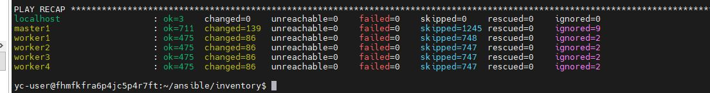
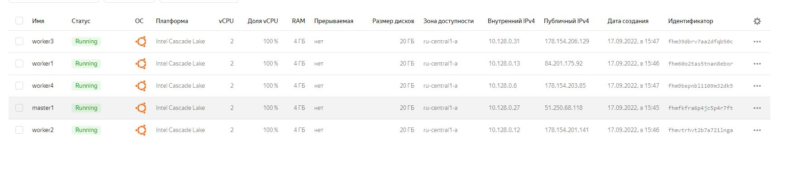
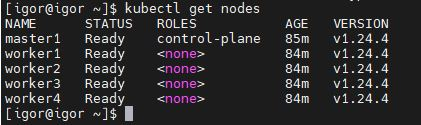

# Домашнее задание к занятию "12.4 Развертывание кластера на собственных серверах, лекция 2"
Новые проекты пошли стабильным потоком. Каждый проект требует себе несколько кластеров: под тесты и продуктив. Делать все руками — не вариант, поэтому стоит автоматизировать подготовку новых кластеров.

## Задание 1: Подготовить инвентарь kubespray
Новые тестовые кластеры требуют типичных простых настроек. Нужно подготовить инвентарь и проверить его работу. Требования к инвентарю:
* подготовка работы кластера из 5 нод: 1 мастер и 4 рабочие ноды;
* в качестве CRI — containerd;
* запуск etcd производить на мастере.  

---
#### Inventory
````text
[all]
master1 ansible_host=51.250.68.118 ansible_user=yc-user
worker1 ansible_host=84.201.175.92 ansible_user=yc-user
worker2 ansible_host=178.154.201.141 ansible_user=yc-user
worker3 ansible_host=178.154.206.129 ansible_user=yc-user
worker4 ansible_host=178.154.203.85 ansible_user=yc-user


# ## configure a bastion host if your nodes are not directly reachable
# [bastion]
# bastion ansible_host=x.x.x.x ansible_user=some_user

[kube_control_plane]
master1

[etcd]
master1

[kube_node]
worker1
worker2
worker3
worker4


[calico_rr]

[k8s_cluster:children]
kube_control_plane
kube_node
calico_rr
````
#### Строка CRI из group_vars
````text
container_manager: containerd  
````


## Задание 2 (*): подготовить и проверить инвентарь для кластера в AWS
Часть новых проектов хотят запускать на мощностях AWS. Требования похожи:
* разворачивать 5 нод: 1 мастер и 4 рабочие ноды;
* работать должны на минимально допустимых EC2 — t3.small.

---  

### Скриншты установленного кластер и доступа к нему с локального хоста





### Как оформить ДЗ?

Выполненное домашнее задание пришлите ссылкой на .md-файл в вашем репозитории.

---  
