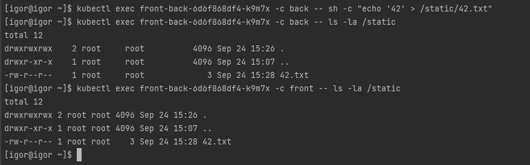
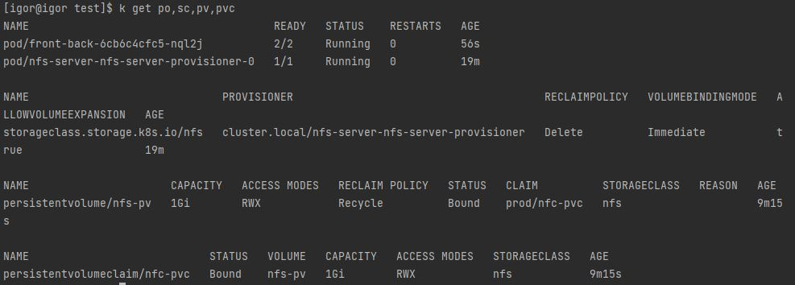
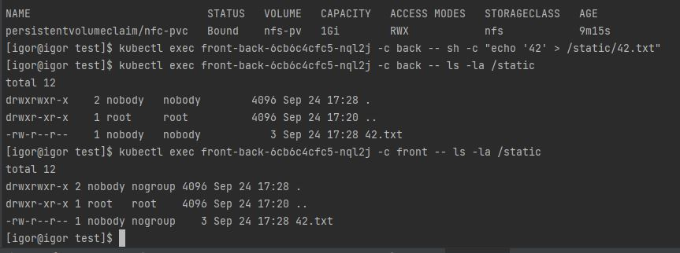
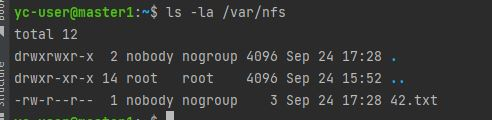

# Домашнее задание к занятию "13.2 разделы и монтирование"
Приложение запущено и работает, но время от времени появляется необходимость передавать между бекендами данные. А сам бекенд генерирует статику для фронта. Нужно оптимизировать это.
Для настройки NFS сервера можно воспользоваться следующей инструкцией (производить под пользователем на сервере, у которого есть доступ до kubectl):
* установить helm: curl https://raw.githubusercontent.com/helm/helm/master/scripts/get-helm-3 | bash
* добавить репозиторий чартов: helm repo add stable https://charts.helm.sh/stable && helm repo update
* установить nfs-server через helm: helm install nfs-server stable/nfs-server-provisioner

В конце установки будет выдан пример создания PVC для этого сервера.

## Задание 1: подключить для тестового конфига общую папку
В stage окружении часто возникает необходимость отдавать статику бекенда сразу фронтом. Проще всего сделать это через общую папку. Требования:
* в поде подключена общая папка между контейнерами (например, /static);
* после записи чего-либо в контейнере с беком файлы можно получить из контейнера с фронтом.  

---

#### Deployment and screenshot

```yaml
apiVersion: apps/v1
kind: Deployment
metadata:
  labels:
    app: front-back
  name: front-back
  namespace: stage
spec:
  replicas: 1
  selector:
    matchLabels:
      app: front-back
  template:
    metadata:
      labels:
        app: front-back
    spec:
      containers:
        - image: nginx:1.20
          imagePullPolicy: IfNotPresent
          name: front
          volumeMounts:
            - mountPath: "/static"
              name: static-volume
        - image: praqma/network-multitool:alpine-extra
          imagePullPolicy: IfNotPresent
          name: back
          volumeMounts:
            - mountPath: "/static"
              name: static-volume
          env:
            - name: HTTP_PORT
              value: "8080"
      volumes:
        - name: static-volume
          emptyDir: {}
```  
   

## Задание 2: подключить общую папку для прода
Поработав на stage, доработки нужно отправить на прод. В продуктиве у нас контейнеры крутятся в разных подах, поэтому потребуется PV и связь через PVC. Сам PV должен быть связан с NFS сервером. Требования:
* все бекенды подключаются к одному PV в режиме ReadWriteMany;
* фронтенды тоже подключаются к этому же PV с таким же режимом;
* файлы, созданные бекендом, должны быть доступны фронту.

---
#### Описание выполнения/конфиги/скриншоты
````text
Была создана NFC шара на мастер ноде
Путь к ней прописан в PersistentVolume
Итоги деплоя представлены на скриншотах, все работает, контейнеры видят общее хранилище,также на мастер ноде виден файл созданный в контейнере
````
  
  
  

[Ссылка на конфиг PersistentVolume](./prod/pv.yaml)
[Ссылка на конфиг PersistentVolumeClaim](./prod/pvc.yaml)
[Ссылка на конфиг deployment](./prod/dpl.yaml)


---

### Как оформить ДЗ?

Выполненное домашнее задание пришлите ссылкой на .md-файл в вашем репозитории.

---