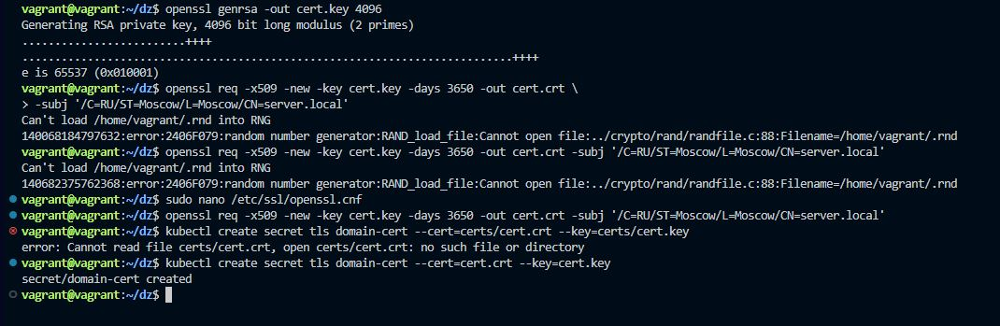
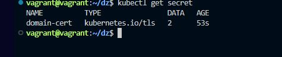
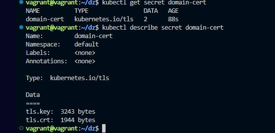
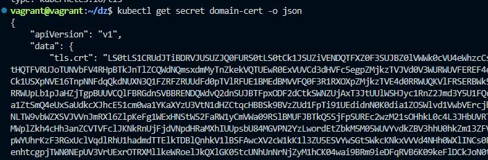
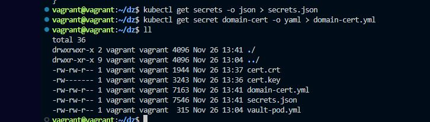
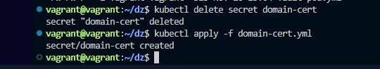
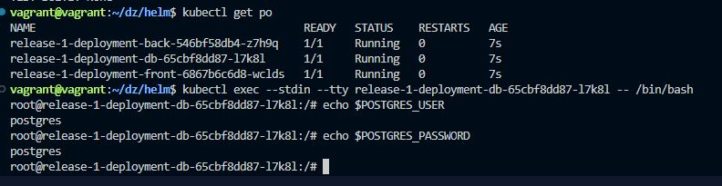
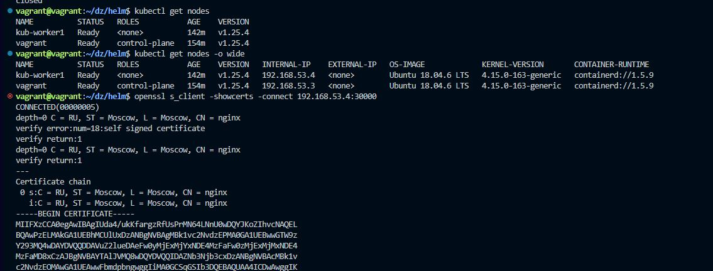

# Домашнее задание к занятию "14.1 Создание и использование секретов"

## Задача 1: Работа с секретами через утилиту kubectl в установленном minikube

Выполните приведённые ниже команды в консоли, получите вывод команд. Сохраните
задачу 1 как справочный материал.

### Как создать секрет?

```
openssl genrsa -out cert.key 4096
openssl req -x509 -new -key cert.key -days 3650 -out cert.crt \
-subj '/C=RU/ST=Moscow/L=Moscow/CN=server.local'
kubectl create secret tls domain-cert --cert=certs/cert.crt --key=certs/cert.key
```

  
### Как просмотреть список секретов?

```
kubectl get secrets
kubectl get secret
```
  
### Как просмотреть секрет?

```
kubectl get secret domain-cert
kubectl describe secret domain-cert
```
  
### Как получить информацию в формате YAML и/или JSON?

```
kubectl get secret domain-cert -o yaml
kubectl get secret domain-cert -o json
```
  
### Как выгрузить секрет и сохранить его в файл?

```
kubectl get secrets -o json > secrets.json
kubectl get secret domain-cert -o yaml > domain-cert.yml
```
  
### Как удалить секрет?

```
kubectl delete secret domain-cert
```
  
### Как загрузить секрет из файла?

```
kubectl apply -f domain-cert.yml
```
  
## Задача 2 (*): Работа с секретами внутри модуля

Выберите любимый образ контейнера, подключите секреты и проверьте их доступность
как в виде переменных окружения, так и в виде примонтированного тома.

---  
#### Создал секрет для деплоймента БД



````yaml
apiVersion: v1
data:
  POSTGRES_PASSWORD: cG9zdGdyZXM=
  POSTGRES_USER: cG9zdGdyZXM=
kind: Secret
metadata:
  creationTimestamp: "2022-11-26T14:02:33Z"
  name: db-secret
  namespace: app1
  resourceVersion: "6605"
  uid: 5fba0731-8a8c-44b4-8190-75e79e032ed1
type: Opaque

````
#### Создал секрет с сертами для nginx  

````yaml
apiVersion: v1
data:
  tls.crt: LS0tLS1CRUdJTiBDRVJUSUZJQ0FURS0tLS0tCk1JSUZYekNDQTBlZ0F3SUJBZ0lVZGE0L3VrS2Zhcmd6UmZVc1ByTU42NExOblUwd0RRWUpLb1pJaHZjTkFRRUwKQlFBd1B6RUxNQWtHQTFVRUJoTUNVbFV4RHpBTkJnTlZCQWdNQmsxdmMyTnZkekVQTUEwR0ExVUVCd3dHVFc5egpZMjkzTVE0d0RBWURWUVFEREFWdVoybHVlREFlRncweU1qRXhNall4TkRFNE16RmFGdzB6TWpFeE1qTXhOREU0Ck16RmFNRDh4Q3pBSkJnTlZCQVlUQWxKVk1ROHdEUVlEVlFRSURBWk5iM05qYjNjeER6QU5CZ05WQkFjTUJrMXYKYzJOdmR6RU9NQXdHQTFVRUF3d0ZibWRwYm5nd2dnSWlNQTBHQ1NxR1NJYjNEUUVCQVFVQUE0SUNEd0F3Z2dJSwpBb0lDQVFDM1luand3RDhlY3BQVjMzMmxaNHBxam1kaitTVHJ6c3JKWG9mUS9uNnIzVjFhUlovbzc4MVA5R2Q1CmF2cTNONHJSclZ4YnZIUFZDZENYT2NEakwxZEdEQ2FuMG12UnNHc1hxeDhnd3FUN29GN0orc3k0UmpBWmtKT2EKaW84NFY0bWxQbTU3ZGRGb01zVXNXdzhuTWEzMU85a2xINE1oc1RLdmQvcWZQRnhzNHJKc2hEL2orYTBXSndWaQo4ZWJqWmhaS2RnSWVUSVVOcnRrMnR6TGVvWjR1UlFLMVA0Q1o0REJqTFc3Qm41S0M2TzZ6WkM5U0JJRjQ2T2RKCjRBV2ZmeUVISGxRUGgvNW90L2ZDVVdUVVVLdnFrcXpMa2hackk1c1Y4YlVCZkhrOUhlMTkyZlpWY0piTndwK2UKc3NDUVRndGVFZnhhS25IcmxQSGxoRnVFSUI5ZzVOcml3ZFpiTS9ldk5tSmdjYXlFSVpqWitGWXU3R2MzRi9UMgphN2tiWmRtbm0rR2JXVFBZOXllT202M3BTVTUrMFBhaGJlMmZCUHdpTFRoR3lOYW9aSjk4UGxTSTc5ZkthZmdMCjhwR0xmUFBVL0d3dGhpTVBJcmVzTWtGd0R3c05zSXgvZjNBYTB0MnVzWElLbXp0d3J1SXE0dFBwckFDdEgxUGoKZFJhLzY5R2JNYURsR251bUM3WDIzKzJ5ZkEvRE1xRmFwLzVDYnFlbXZCOWh3UEw4QlFRZjNqMGtmMitsUU13UgpZelYwaHJycmJZdGdYZ1M2OGMrWWdicEVQLzhxc0RJclJMa1JWbEExS1B3ckMxa3lKQlVYcVlCdW1oVTczeUIyCmNCNk00bERPYkJXOFhRZzk0WW4zY0dVczRRWTU4QXM5eStkZUZidStrd2xGYW1RUU13SURBUUFCbzFNd1VUQWQKQmdOVkhRNEVGZ1FVNHp5UlZybGtnVFZvS3krNjZ3bFB5b1JsSnJZd0h3WURWUjBqQkJnd0ZvQVU0enlSVnJsawpnVFZvS3krNjZ3bFB5b1JsSnJZd0R3WURWUjBUQVFIL0JBVXdBd0VCL3pBTkJna3Foa2lHOXcwQkFRc0ZBQU9DCkFnRUFpRVdObUovTEpuVUo4ckVjNlFCdzY2N3RuY3FJaC82aTNCbFlBMUhYN2lxb0kzZEZ1UWFXc2tpbWpZdVMKSVduc0tVYWFhSkdJaWtJS1BLQTBLcWY5Y2xLVGlJRWt3YlJRVHVvb1UrNjJ5QUJGUUZnQ2hBNUVxRkJkelpLeQpFQktrQlBIcmdmUkRNelRnYnQxYU81bksrbXp5MmNDSU5LVmN1c0t4QmpFYzNEaE5USVhCK29pUk8velpLOTIzCkFUY0ltMXUvNkE3WWNmalhESTBjVHJUMWQvL3VQQ1FVTmJsblFXZVZxK0lXM0F4aTRrc0FEb0psWldIUWZZMU4KSkVoNlBwNVUyYzQ4ODR4V1BiamxKRXhYU0ZqY2FrYjRlTnZHenp4Z1FJZ1A3V2VkOUpMZnVnTGtGVXZraVBTOApzYy9Uc3RZZWkydHpZVzVPYjBjMDM3SXkzZDBLYnpMRGwzbE1Fc0lDL29oemVlMmVVbVpySmtsNmNUYzRZZ25kClFLMTF2SkpTNXF4Nm1jOGpCK2RXWDQyT3dIc29BYncydjVmeEszYXVNM3ZOT2dHc0hLV2orUEdURjJOT1kxRnkKMjA1bWZxR1c5WCszREpwN3lvZnZaRXNPRTZjbVB5QjFPTmhqcGlKTXgvckxlZFA1Z1U1YjBtUE0xazZzVXFYRQo5NTkzSm1oY1ZnM05VNWpUajJBUVNETEw0R0NGOFZhYWwrMGplUnR0Mk1yQ0M5K3dMMm5PMlJ6WkJmNUFsa1JpCitOT1JLK2xYTWZrL1B5b3ZVZE1MQ29MTUh5MzZWUmt5QTVHT1NlaE5qVlFFd2FIeEhwRitCdWZFZEl5QW1VNnYKUTM5QnU2cVh6QmIvTnlLVFRVYmk3ZzhRWlpWQzIybG93VElZVjZwb3prN1EzZTQ9Ci0tLS0tRU5EIENFUlRJRklDQVRFLS0tLS0K
  tls.key: LS0tLS1CRUdJTiBSU0EgUFJJVkFURSBLRVktLS0tLQpNSUlKS1FJQkFBS0NBZ0VBdDJKNDhNQS9IbktUMWQ5OXBXZUthbzVuWS9razY4N0t5VjZIMFA1K3E5MWRXa1dmCjZPL05UL1JuZVdyNnR6ZUswYTFjVzd4ejFRblFsem5BNHk5WFJnd21wOUpyMGJCckY2c2ZJTUtrKzZCZXlmck0KdUVZd0daQ1Rtb3FQT0ZlSnBUNXVlM1hSYURMRkxGc1BKekd0OVR2WkpSK0RJYkV5cjNmNm56eGNiT0t5YklRLwo0L210RmljRll2SG00MllXU25ZQ0hreUZEYTdaTnJjeTNxR2VMa1VDdFQrQW1lQXdZeTF1d1orU2d1anVzMlF2ClVnU0JlT2puU2VBRm4zOGhCeDVVRDRmK2FMZjN3bEZrMUZDcjZwS3N5NUlXYXlPYkZmRzFBWHg1UFIzdGZkbjIKVlhDV3pjS2ZuckxBa0U0TFhoSDhXaXB4NjVUeDVZUmJoQ0FmWU9UYTRzSFdXelAzcnpaaVlIR3NoQ0dZMmZoVwpMdXhuTnhmMDltdTVHMlhacDV2aG0xa3oyUGNuanB1dDZVbE9mdEQyb1czdG53VDhJaTA0UnNqV3FHU2ZmRDVVCmlPL1h5bW40Qy9LUmkzenoxUHhzTFlZakR5SzNyREpCY0E4TERiQ01mMzl3R3RMZHJyRnlDcHM3Y0s3aUt1TFQKNmF3QXJSOVQ0M1VXdit2Um16R2c1UnA3cGd1MTl0L3RzbndQd3pLaFdxZitRbTZucHJ3ZlljRHkvQVVFSDk0OQpKSDl2cFVETUVXTTFkSWE2NjIyTFlGNEV1dkhQbUlHNlJELy9LckF5SzBTNUVWWlFOU2o4S3d0Wk1pUVZGNm1BCmJwb1ZPOThnZG5BZWpPSlF6bXdWdkYwSVBlR0o5M0JsTE9FR09mQUxQY3ZuWGhXN3ZwTUpSV3BrRURNQ0F3RUEKQVFLQ0FnRUFzWUZ6cHpXdTR2M3M4endkRnBtZWRYM1p2ZjlQS2FGRTBKM2J3UVJXQUcySkN2UVIwUnN0RkpOeQpCU2p6L1p5WmxsUEQ3bGYvbHRxbE9Yd0JwT1lTQ0ErQzZ6YldmbVhSZzF0MENmWGVWR0hxM244UTRkMnVlVkJrClQxYUhRdllZbWdaUVV0aThGYXZ2QnZ3dE1yYjN0MFJ5NzJnTk9mT1hLQmx1VWV2UFd1WWo1cjRzU2JOSFF3WUsKUkxmNTBXcmpjTGZCWFNxY0w1NXJTbmNSbWtXK0l2TlJwN2NMOStYMWNFcHR4cVY2MzVRd1dSeEVZWk5TNzRJaApQblRGZkpsRmt1cGNXNXc3T1ltNUhESkU4dTRUT2o4M1d1VFJKbXVVbGkwY0U1QTBtbC81bmJQNHFNTU9kYVJKCmRRZDVOVFVWODd4ZEU3bTZBMXBzdXNqZS9JbExWSThWek01d1h6ZEptUnloVy8yNVNtVllvMXdqRWl0UGpHZ1cKNUF0UG5PNE10VkZNQU85RG11bTltWlJvNG1SK1l4NTZabG1rNTh3aHpWVElJU0IzTjNGdWxVdlZkb3IyblZrZQo5MlVTbkNGWHVnRW9qRmNlZGxNOFNCaEVDZTNKYXBSMURQYlUwNlIza2ZQVGpvaGh1LzlxVk1zeVVNbUlOSG1BCjR3ZlU1ZVFSQmt5RTZXT2dmb2R2SURMd0pSdkJWMnBUMWg0REV2S09oSzRoUmpCVlFURFQzMXNOaXh0Z1BzS0MKZUptNklQL1h3WVM2VFQ4aGlmWlFOc1Z4bFVXZFhLYUpkenJmUkNQS1V3K1BFajg2Q0VyM1ViSWxUY1l3MG1JcQo2aldQY3psM2NYTUE1YkpGUDlUZ0JxaEY4QVRKZURKWUg0REw2SUtESDZ0dnIzY1BXWUVDZ2dFQkFONkg5bnNlCjdWMm9MOEpNVXZkN2JBSER0RndJQjlNYzJBU2ZjNjFlajhQRy9ybXM0VUVhUUtDTUhGQitvL0VnQzhjekF4dGcKZUMrbTZGU2pSRndGRE84YW1YRVBpTFJwdE4rbnZ3Nzk1ZWVTTkFKTGNVNnZlb0xYeDNCUjF6MEtJaHJjM3AyVgpCeDRDUWNkbG5va3hielh0djY5Nk5heitNWXV4NHJvWUJtLzN5UUJVd0Z5cjZ1d25JZVBXcUYxSWp5S3NiMFpiCjdlOVc1bmZOck9NVDR0MHhRRmRHdm5nRDRDWVpNc2l6KzEyeEt4aWtqVGo5bnQ4YldmenJJM0tVUHJyeVZaY1YKUkY4c2dJRDhEUDRlTWRzeUk2eDk5Ykc2eWJRbTVXaDd2eDRKQjFoQmtEVlhUOEc5dzhSL2NyVHo3NHVVdi9IOQplbzVQUnd4QkM3YXlCQkVDZ2dFQkFOTDNSSVprbUxJNnRIem43b1VwMEVmYWFBeUlWaFJMcmhmamxBSEQzMmVaCldteVdrb0FKcTRhcEh5Y3BUWlpzUGxTSFo0MDNIN0c3bUI5Y0poUzJoVnVSLzZObXl3N080MUtqUlBxbTdwUTQKUGlKc3ZqZzNDcEd3OEQrbXVOS3pTbW16TEl1bUh0TEJlWjdpVkd3Y25jSFQ0QWcwckQrYlkrT2N1T0RkY3NzQQpMb0QrczVEaFJOVkgzMEpPc3FWUVhoRFkrYlZQakhqYVJSMXcwOVpSczczVVUwRmVudEJRWGkreDMxQWdtOWVRCnFhcDlGY1lxSm11OGFHYTM3OWlnT3YycXhSMXVWMnZhcXFnV3RaSGFwbUpzMW1qb2xKZjRkYzNRREJCdFFicWQKMWh5MnRjVm51NU1CYUpuSWluWDI5VEhDUFdBWEpYbjZpczVnS1NVaHhBTUNnZ0VBV21Va3JQTHRQVVJhMGpTcQo1emxOc0pITkxDMWU4RlVoTXcrS3IveGZyZ21oNDg3a1djdk9RT2xwZnhGU2kxcVhMajM4bnh4YTloQjVCQmltClpqTHZCQm5zQnM5bW10THQxSVNSeWdjOVl3b3k4bE92SFdXUEFLT2lzbStzWFhGR1ZWOHZWeGY0b2lvTWluRXYKSzAvWGV6S3UwUnQxdm1ZcnZqRnVobVhJQjZmQ0VNNWNyY2h3VDZtOXpJMmdLdlNVb0dNbmVJOVRZZ3dNNXRHMwp6eTUrMDVkMEtYL2xVMTlQcUdwSUJOdUgycEZqamtrWnpQTEpuSnZCdkVuUVJuVU4zbWNlZVpiOEJTVlF0aFN0Ck9uVU5qNXNZZnJOVUlQUmRoejdkcGNuTzR1YU1Bei91MHB3N0c5cDRNZFFMeHBIbzF1eC81RTh4ZjZtWWxOTy8KYkdGMzRRS0NBUUVBaytFV0hLcVpTcDNSOUpoVFh1NnZmQjZCdnY4MmI2V1pGRS9IYVBGWFFYU0NxUWxuQ2U4OQpWL2hteVBtdjFGaHQzS3pKam5oc2RCYU9qTFQ0VUo2Y25sS2FBbjFFcTAya2xVR3pVWXdBUXMrbDVsV1poU2czCjlXWTFFamtZNTBFY1VUbHlhVFY1OTd2OU43MW85aHVkRGNncUN6WjQ0MkZXUksrUC9MZmVCcVJLOU1zVkxlSnEKY0tLZndnZ09POGs1RnRBeFFjSFFNc3ExbGV5SDRYeUY1UFBYcEVQaVNSMTgyQ3Z6NEdQck9kREN6YW8rd0JpOQpzOWx1eVVuNEN6NU4rNUJmK2NCbDhVbG5STW9lWG00SklZY3ZTSHgzNUlzYWNMbDhLMnVhbm1pVE5LOXlmVHk0CmhGU0JjUUxjNDlISGtDaWJBeWRXY3NtSDBTQWcxMUZ5NXdLQ0FRQmVmZWJmZDVheDR6L1l2NUJ6VFBocFJicjIKYStsYkJMWjZ6eENscjZEUlZqbUp3SHllbE1rcWhtQkhoZjByZHlxdHptNU9tZmY1d1ZOVytXQXlDbU13ZGIycgpjRG9lWUdGMUVVS0ZsY2N1NjhESlhQR08wY29INEp6SGlUMmpJdjg3UmNINER0ZTlQS3lrMVVvRzI4YTZwU2RHCkZMSHp5Q1kyK2xRVkxlTThDMGR5clRzVjdndjdFZ2svM0o5RWw0dWwweVB1bzVaMHE4WmgyWCtNSG5yOU1HamYKNmJnNWJEMXRrc3JWRGR0YlBnYWU5WTJpcm1GdVJXcHR5UzJCQkxqZk1tbG5QRE9wMVJ0TjEzK1BIMGNHZnpMVApqek91QUNXVW5EZzh4TUk4L1liRGk0Vk91MG00U1ZpZlFmRm9uWStqNGNJUUJnckhqN01IaUtQR1NLSjMKLS0tLS1FTkQgUlNBIFBSSVZBVEUgS0VZLS0tLS0K
kind: Secret
metadata:
  creationTimestamp: "2022-11-26T14:19:23Z"
  name: nginx-cert
  namespace: app1
  resourceVersion: "8031"
  uid: 82a4799d-4dc2-4d9d-a034-e9db0b02f9a2
type: kubernetes.io/tls


````


------
### Как оформить ДЗ?

Выполненное домашнее задание пришлите ссылкой на .md-файл в вашем репозитории.

В качестве решения прикрепите к ДЗ конфиг файлы для деплоя. Прикрепите скриншоты вывода команды kubectl со списком запущенных объектов каждого типа (deployments, pods, secrets) или скриншот из самого Kubernetes, что сервисы подняты и работают, а также вывод из CLI.

---