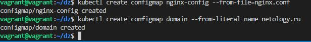
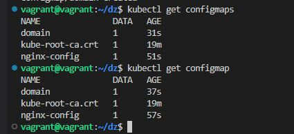
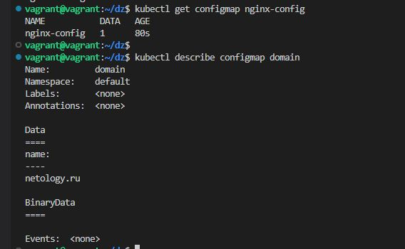
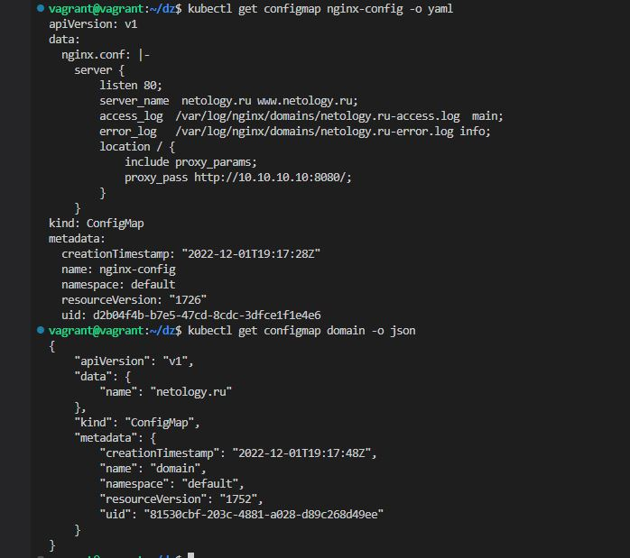
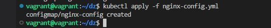
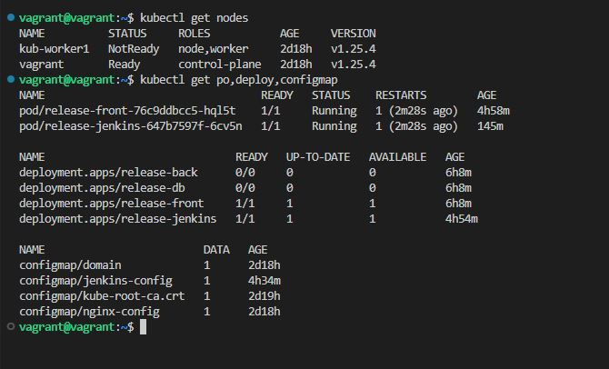

# Домашнее задание к занятию "14.3 Карты конфигураций"

## Задача 1: Работа с картами конфигураций через утилиту kubectl в установленном minikube

Выполните приведённые команды в консоли. Получите вывод команд. Сохраните
задачу 1 как справочный материал.

### Как создать карту конфигураций?

```
kubectl create configmap nginx-config --from-file=nginx.conf
kubectl create configmap domain --from-literal=name=netology.ru
```
  

### Как просмотреть список карт конфигураций?

```
kubectl get configmaps
kubectl get configmap
```
  
### Как просмотреть карту конфигурации?

```
kubectl get configmap nginx-config
kubectl describe configmap domain
```
  
### Как получить информацию в формате YAML и/или JSON?

```
kubectl get configmap nginx-config -o yaml
kubectl get configmap domain -o json
```
  
### Как выгрузить карту конфигурации и сохранить его в файл?

```
kubectl get configmaps -o json > configmaps.json
kubectl get configmap nginx-config -o yaml > nginx-config.yml
```
  
### Как удалить карту конфигурации?

```
kubectl delete configmap nginx-config
```
  
### Как загрузить карту конфигурации из файла?

```
kubectl apply -f nginx-config.yml
```
  
## Задача 2 (*): Работа с картами конфигураций внутри модуля

Выбрать любимый образ контейнера, подключить карты конфигураций и проверить
их доступность как в виде переменных окружения, так и в виде примонтированного
тома

---

### Как оформить ДЗ?

Выполненное домашнее задание пришлите ссылкой на .md-файл в вашем репозитории.

В качестве решения прикрепите к ДЗ конфиг файлы для деплоя. Прикрепите скриншоты вывода команды kubectl со списком запущенных объектов каждого типа (pods, deployments, configmaps) или скриншот из самого Kubernetes, что сервисы подняты и работают, а также вывод из CLI.

---    
  


````yaml
apiVersion: apps/v1
kind: StatefulSet
metadata:
  labels:
    app: front
  name: "{{ .Release.Name }}-front"
  namespace: {{ .Values.namespace_app1 }}
spec:
  replicas: 1
  selector:
    matchLabels:
      app: front
  template:
    metadata:
      labels:
        app: front
    spec:
      containers:
      - image: "{{ .Values.image.repositoryfront }}:{{ .Values.image.tagfront }}"
        imagePullPolicy: IfNotPresent
        name: front
        env:
          - name: HOST_BACK
            value: back:8080
        volumeMounts:
        - name: nginx-cert  ## Use this name inside volumes to define mount point
          mountPath: "/etc/nginx/ssl/"  ## This will be created if not present
        - name: nginx-config
          mountPath: "/etc/nginx/"
      volumes:
        - name: nginx-cert  ## This must match the volumeMount name
          secret:
            secretName: nginx-cert     
        - name: nginx-config
          configMap:
            name: nginx-config
````

````yaml
apiVersion: v1
kind: ConfigMap
metadata:
  name: nginx-config
data:
  nginx.conf: |
    user  nginx;
    worker_processes  auto;

    error_log  /var/log/nginx/error.log notice;
    pid        /var/run/nginx.pid;


    events {
        worker_connections  1024;
    }


    http {
        default_type  application/octet-stream;

        log_format  main  '$remote_addr - $remote_user [$time_local] "$request" '
                          '$status $body_bytes_sent "$http_referer" '
                          '"$http_user_agent" "$http_x_forwarded_for"';

        access_log  /var/log/nginx/access.log  main;

        sendfile        on;
        #tcp_nopush     on;
        tcp_nodelay      on;
        keepalive_timeout  65;
        #gzip  on;
        include /etc/nginx/conf.d/*.conf;

      upstream proxy{
        server 192.168.53.4:31415;
      }  
      server {
        listen              443 ssl;
        server_name         server.ru;
        ssl_certificate     /etc/nginx/ssl/tls.crt;
        ssl_certificate_key /etc/nginx/ssl/tls.key;
        ssl_protocols       TLSv1 TLSv1.1 TLSv1.2;
        ssl_ciphers         HIGH:!aNULL:!MD5;
        location / {
            proxy_pass         http://proxy$uri;
            proxy_redirect     off;
            proxy_set_header   Host             $host;
            proxy_set_header   X-Real-IP        $remote_addr;
            #proxy_set_header  X-Forwarded-For  $proxy_add_x_forwarded_for;

            client_max_body_size       10m;
            client_body_buffer_size    128k;


            proxy_connect_timeout      70;
            proxy_send_timeout         90;
            proxy_read_timeout         90;
            proxy_send_lowat           12000;

            proxy_buffer_size          4k;
            proxy_buffers              4 32k;
            proxy_busy_buffers_size    64k;
            proxy_temp_file_write_size 64k;
            charset  koi8-r;
        }

      }	
    }
      
    
````